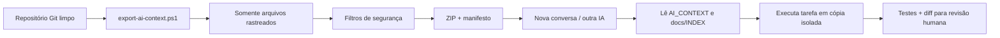

# Mapa para exportar o projeto e trabalhar com outra IA

## 1. Objetivo

O pacote de IA entrega arquitetura, documentação, schema, código e testes suficientes para análise ou implementação, sem levar configuração privada, dependências baixadas, dados de clientes, plantas reais ou backups.



## 2. Mapa do conteúdo

```text
orca/
├── AI_CONTEXT.md             entrada obrigatória para IA
├── README.md                 uso rápido e versões
├── VERSION / CHANGELOG.md    versão e histórico
├── docs/                     arquitetura, dados, processos e operação
├── bootstrap/app.php         inicialização completa
├── config/                   defaults e exemplo sem segredo
├── src/
│   ├── Domain/               regras reutilizáveis
│   ├── Infrastructure/       PDO, prefixo, schema e seed
│   ├── Security/             sessão
│   └── Support/              configuração
├── includes/auth.php         identidade, perfis, CSRF e helpers HTTP
├── helpers/                  importação, layout, logs e mensagens
├── admin/                    fluxos administrativos
├── cliente/                  portal restrito do cliente
├── database/
│   ├── schema.sql            instalação nova
│   └── migrations/           evolução de instalações existentes
├── tests/                    testes locais
├── health.php                disponibilidade
├── migrate.php               migração protegida
├── smoke.php                 teste integrado protegido
├── provision-admin.php       recuperação administrativa protegida
└── scripts/export-ai-context.ps1
```

## 3. O que entra no pacote

O script usa `git ls-files`, portanto inclui apenas arquivos rastreados pelo repositório:

- documentação e contexto;
- PHP, JavaScript, CSS e SVGs demonstrativos;
- schema e migrações;
- manifesto Composer e lock;
- testes e scripts seguros;
- exemplos de configuração sem valores reais.

O pacote gera `EXPORT_MANIFEST.txt` com versão, commit, data UTC, aviso de segurança e lista dos arquivos incluídos.

## 4. O que fica de fora

- `config/runtime.php` e `.env*`;
- `.git/` e configuração de credenciais Git;
- `vendor/` e `node_modules/`;
- `uploads/`, inclusive plantas e respostas reais;
- `storage/backups/`, dumps e cópias de banco;
- logs, ZIPs e outros artefatos;
- cookies, tokens, senhas e chaves;
- dados exportados da Hostinger/GitHub que não pertençam ao código.

O arquivo `.aiignore` registra essas exclusões para ferramentas que aceitam um arquivo de ignore. Mesmo assim, revise o ZIP antes de enviar.

## 5. Gerar o pacote

Na raiz do repositório, com PowerShell:

```powershell
powershell -ExecutionPolicy Bypass -File scripts/export-ai-context.ps1
```

Para outro diretório de saída:

```powershell
powershell -ExecutionPolicy Bypass -File scripts/export-ai-context.ps1 -OutputDirectory C:\caminho\seguro
```

O nome inclui versão e commit, por exemplo:

```text
orca-ai-context-v1.2.3-abcdef0.zip
```

Se o nome já existir, o script acrescenta data/hora e não apaga o arquivo anterior.

## 6. Conferência antes de compartilhar

1. verifique que `git status --short` não contém arquivos secretos rastreados;
2. abra `EXPORT_MANIFEST.txt` dentro do ZIP;
3. pesquise no conteúdo por termos como `password`, `senha`, `secret`, `token` e nomes de clientes;
4. confirme que apenas exemplos/placeholders aparecem;
5. não anexe dump SQL de produção nem a pasta de uploads;
6. use uma conversa/projeto privado quando o código for proprietário;
7. peça à IA para produzir um diff, não para publicar diretamente.

## 7. Prompt-base para outra IA

Copie o texto abaixo e ajuste apenas a seção da tarefa:

```text
Você está trabalhando no Orçamentista Leme. O ZIP anexado é um pacote de
contexto sem dados de produção. Comece lendo AI_CONTEXT.md e depois
docs/INDEX.md na ordem indicada.

Tarefa:
[descreva a melhoria e o resultado esperado]

Restrições:
- preserve PHP 8.1+, MySQL, prefixo lógico de tabelas e compatibilidade;
- preserve isolamento de cliente e validação CSRF;
- não invente credenciais nem solicite runtime, uploads ou banco de produção;
- use migração numerada para qualquer alteração de dados;
- mantenha versões históricas;
- execute os testes existentes e adicione os testes necessários;
- não publique, não altere GitHub/Hostinger e não faça ação destrutiva sem
  autorização explícita.

Entregue:
1. diagnóstico curto;
2. plano da alteração;
3. patch/diff por arquivo;
4. testes executados;
5. impacto de banco/configuração;
6. riscos e rollback;
7. documentos que precisam ser atualizados.
```

## 8. Pacote mínimo por tipo de tarefa

Se a ferramenta não aceitar o ZIP completo, envie estes subconjuntos:

| Tarefa | Arquivos mínimos |
|---|---|
| Interface | `AI_CONTEXT.md`, `docs/ARCHITECTURE.md`, `helpers/layout.php`, `assets/css/style.css`, `assets/js/app.js`, página afetada |
| Dashboard | contexto + `docs/DATA_MODEL.md`, `admin/dashboard.php`, schema/migrações |
| Plantas | contexto + `plantas.php`, `planta-arquivo.php`, `PlantaService.php`, schema, CSS/JS |
| Orçamento | contexto + `docs/PROCESS_FLOWS.md`, `src/Domain/Orcamento/`, telas de orçamento, importador, schema |
| Cotação | contexto + classes/telas de cotação, `helpers/mailer.php`, schema |
| Segurança | contexto + `bootstrap/`, `includes/auth.php`, `src/Security/`, `Config.php`, página afetada |
| Banco | contexto + `docs/DATA_MODEL.md`, `database/`, `TablePrefixer.php`, `DatabaseInstaller.php`, `smoke.php` |
| Deploy | contexto + `docs/DEPLOY.md`, workflow do repositório hospedeiro com todos os Secrets ocultos |

## 9. Como receber a alteração de volta

Prefira patch Git ou arquivos completos acompanhados de hash. Antes de integrar:

1. aplique em branch/cópia isolada;
2. revise diferenças e procure vazamento de segredo;
3. valide regras de autorização e migração;
4. execute testes e lint;
5. teste em banco descartável;
6. atualize documentação/changelog;
7. só então crie commit, tag e publicação.

Uma resposta gerada por IA é proposta de mudança, não evidência de que produção foi validada.
