# Publicação, versionamento e operação

## 1. Ambientes e repositórios

O fluxo atual separa o código-fonte do repositório que representa o conteúdo publicado:

| Papel | Repositório / local | Conteúdo |
|---|---|---|
| Fonte do Orçamentista | `jefersonrte/orca` | Código modular, documentação e tags próprias. |
| Portal/hospedagem | `jefersonrte/lemeinformatica` | Home dos módulos, pasta versionada do Orçamentista e workflow Hostinger. |
| Produção atual | `/orca-funcional-v1.2.3/` | Versão funcional recomendada. |
| Histórico | `/orca-funcional-v1.2.2/`, `/orca-funcional-v1.2.1/`, `/orca-funcional-v1.2.0/`, `/orca-v1.2.0/`, `/orca/` | Versões anteriores preservadas para consulta/rollback. |

O repositório fonte possui ainda o remoto histórico `claude-origin`, correspondente à base inicial. Ele não é o destino normal de publicação.

## 2. Configuração privada

Não versionar `config/runtime.php`. Em produção, o workflow cria esse arquivo durante o staging usando GitHub Actions Secrets. O arquivo contém URL, banco, prefixo, chave operacional, nome da sessão e modo de demonstração.

Secrets esperados no repositório hospedeiro:

- credenciais FTPS da Hostinger;
- host, nome, usuário e senha do banco;
- chave operacional usada por migração/smoke/provisionamento.

Nunca imprima esses valores em logs, documentação, artefatos de CI, prompt de IA ou URL. Para desenvolvimento, copie `config/runtime.example.php` para `config/runtime.php` e use credenciais locais.

## 3. Instalação local

Requisitos:

- PHP 8.1 ou superior com PDO MySQL, mbstring, fileinfo e extensões exigidas pelo PhpSpreadsheet;
- MySQL/MariaDB;
- Composer;
- GD opcional para miniaturas;
- Poppler/pdftotext opcional para importação de PDF.

```bash
composer install
php -S 127.0.0.1:8080
```

Configure `app.url` como `http://127.0.0.1:8080`, banco local, prefixo de teste e `secure_cookies=false` somente no ambiente HTTP local.

## 4. Validação antes da versão

Na raiz do repositório fonte:

```bash
composer test
composer lint
git status --short
git diff --check
```

Também revisar:

- `VERSION` e `CHANGELOG.md`;
- migrações novas e compatibilidade do prefixo;
- ausência de runtime, uploads, backups e credenciais no diff;
- documentação afetada;
- plano de backup/rollback.

## 5. Política de versão e histórico

Use SemVer:

- `PATCH` para correção compatível, documentação operacional ou segurança sem mudança de contrato;
- `MINOR` para módulo/recurso compatível;
- `MAJOR` para mudança incompatível de dados, URLs ou fluxo.

O histórico precisa existir em dois pontos:

1. commit e tag no repositório fonte, por exemplo `v1.2.1-docs`;
2. commit e tag no repositório hospedeiro, por exemplo `orca-v1.2.1-docs`, quando a cópia publicada mudar.

Não mova uma tag existente e não substitua silenciosamente uma pasta histórica. Uma versão funcional nova deve preferencialmente ganhar outra pasta, como `/orca-funcional-v1.3.0/`, e um novo card na home.

## 6. Fluxo de publicação atual

```mermaid
flowchart LR
    A["Alteração no repositório orca"] --> B["Testes + commit + tag"]
    B --> C["Sincronizar pasta versionada no repositório lemeinformatica"]
    C --> D["CI valida conteúdo e links"]
    D --> E["Workflow gera runtime privado e instala vendor"]
    E --> F["Espelhamento FTPS para Hostinger"]
    F --> G["POST migrate.php"]
    G --> H["POST smoke.php"]
    H --> I["GET health.php"]
    I --> J["Versão aprovada no domínio"]
```



O workflow do repositório hospedeiro:

1. seleciona apenas arquivos rastreados e bloqueia configurações privadas indevidas;
2. gera configurações privadas a partir de Secrets;
3. executa `composer install --no-dev --optimize-autoloader` na versão atual;
4. publica por FTPS sem apagar as versões históricas;
5. testa o comportamento de recuperação de CSRF da versão anterior;
6. aplica schema/migrações e copia uploads das pastas históricas para a versão atual;
7. executa o smoke transacional, confirma a existência física das plantas e confere `health.php`/versão.

Uma publicação só é considerada concluída quando os testes HTTP passam. Código enviado por FTP sem saúde e smoke aprovados não é entrega válida.

## 7. Migrações

`migrate.php` é um endpoint POST protegido por `X-MIGRATION-KEY`. Ele:

1. instala as tabelas base que ainda não existem;
2. lê `schema_migrations`;
3. executa, em ordem, os arquivos ainda não registrados;
4. cria dados demonstrativos somente se `demo.enabled=true`.

O endpoint não deve ser chamado pelo navegador com a chave visível. Use CI ou ferramenta administrativa segura. Migrações destrutivas exigem janela, backup e procedimento específico; o executor simples não fornece rollback automático.

## 8. Backup

Antes de mudança de código com impacto em dados:

- dump consistente das tabelas `orca12_*` e, quando necessário, da estrutura central compatível;
- cópia integral de `uploads/`, preservando caminhos e permissões;
- registro da versão Git/commit associada;
- teste periódico de restauração em ambiente isolado.

O dump do banco não contém os binários das plantas. Um backup sem `uploads/` é incompleto.

Não guarde backup dentro do repositório Git. `storage/backups/` é ignorado e deve ser apenas área operacional temporária.

## 9. Rollback

### Aplicação

Como as versões ficam em diretórios separados, o rollback preferido é alterar o atalho da home para a última pasta funcional e preservar a versão com problema para análise.

### Banco

Migrações aditivas normalmente podem permanecer durante um rollback de aplicação. Para alteração incompatível, não tente “desfazer no improviso”: coloque o sistema em manutenção e restaure o backup validado ou execute um script de reversão revisado.

### Arquivos

Restaure `uploads/` junto com os metadados de `obra_plantas`; versões diferentes entre banco e disco geram documentos 404.

## 10. Verificação pós-publicação

- [ ] home lista a versão nova e mantém as anteriores;
- [ ] login local e login central funcionam;
- [ ] usuário cliente não acessa obra de outro cliente;
- [ ] criação de orçamento calcula o total correto;
- [ ] envio/leitura de cotação atualiza os estados;
- [ ] compra aparece no indicador esperado;
- [ ] upload, miniatura e abertura de planta funcionam;
- [ ] `health.php` retorna HTTP 200 e a versão esperada;
- [ ] smoke protegido retorna `ok=true`;
- [ ] workflow finaliza verde;
- [ ] commit e tags existem nos repositórios correspondentes.

## 11. Provisionamento administrativo

`provision-admin.php` existe para recuperação controlada. Ele aceita somente POST com a chave operacional no cabeçalho e JSON contendo nome, e-mail e senha com no mínimo 10 caracteres. O valor da senha nunca deve aparecer no Git, nos logs ou nesta documentação.

Depois de usar o endpoint:

1. validar o login;
2. rotacionar a chave operacional se houver risco de exposição;
3. revisar logs;
4. preferir que a gestão rotineira de usuários aconteça pela tela administrativa.
