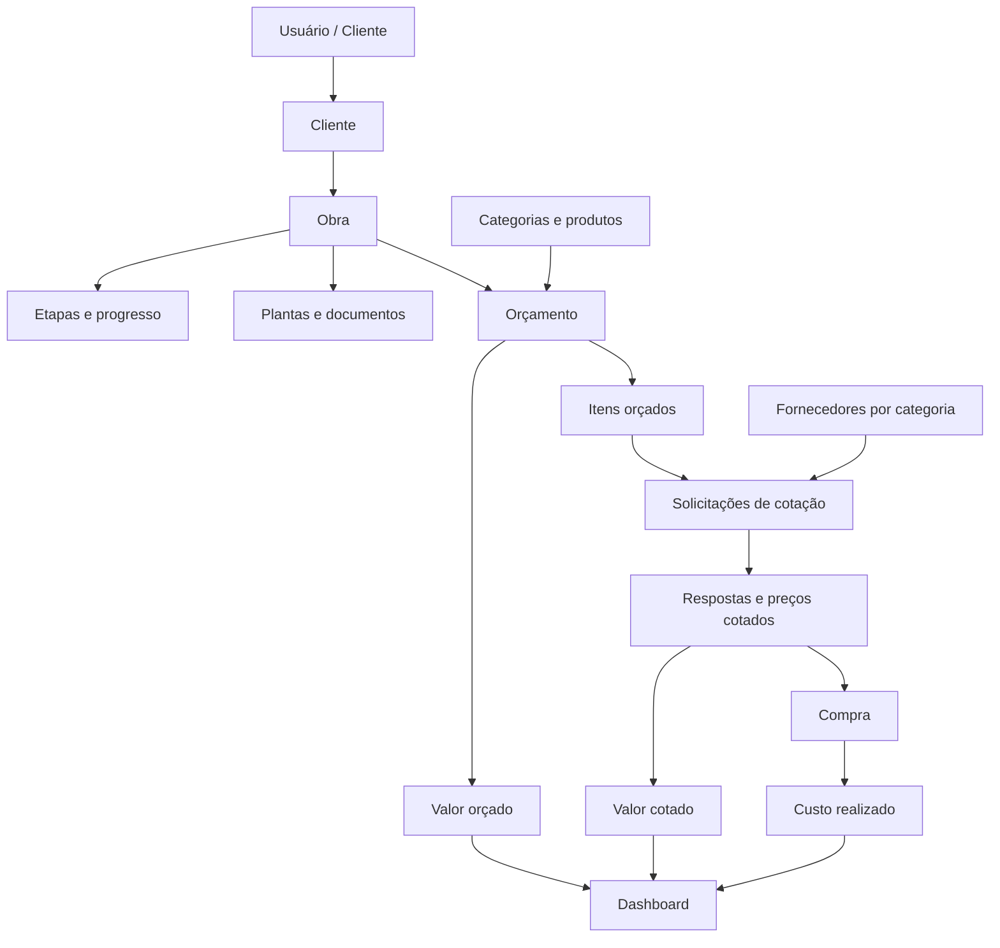
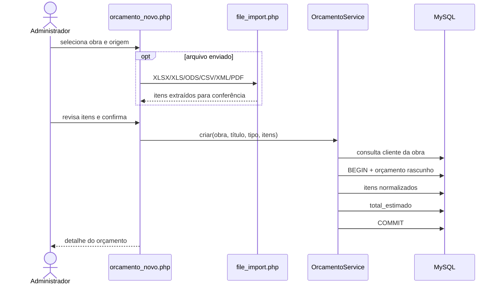
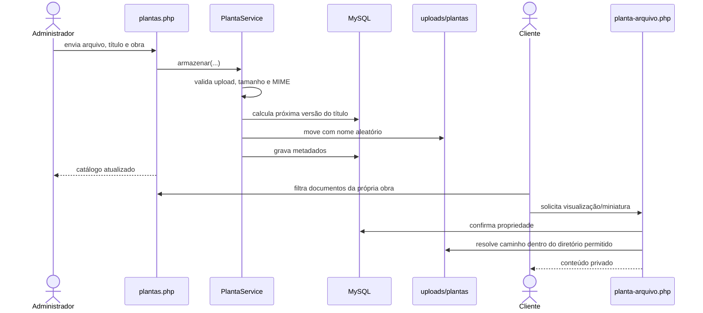

# Fluxos de dados e processos

## 1. Mapa funcional

## 2. Login e sessão

### Login local ou central

1. `login.php` recebe e-mail, senha e token CSRF.
2. Tentativas excedentes bloqueiam a sessão pelo período configurado.
3. O sistema procura um usuário local ativo em `usuarios`.
4. Se a senha local não validar, consulta `usuarios_admin` e aceita somente um administrador central ativo.
5. Um administrador central válido é inserido/atualizado na tabela local sem armazenar senha em texto aberto.
6. O ID da sessão é renovado, os dados mínimos do usuário são gravados na sessão e `ultimo_login`/log são atualizados.
7. Admin vai para `admin/dashboard.php`; cliente vai para `cliente/dashboard.php`.

Se o token do formulário estiver antigo, a tela gera outro token e pede a senha novamente sem exibir a página de erro crua.

### Sessão já aberta no portal

1. `includes/auth.php` detecta o cookie central `LEME_API_SESSAO` antes de abrir a sessão local.
2. Lê os dados centrais, fecha a sessão central e inicia a sessão isolada do Orçamentista.
3. Confirma o administrador em `usuarios_admin`, sincroniza `usuarios` e autentica localmente.

## 3. Cadastro de cliente e obra

### Cliente

1. O admin usa `admin/clientes.php`.
2. É criado/atualizado um registro em `usuarios` com perfil `cliente`.
3. É criado/atualizado o cadastro em `clientes` com o `usuario_id`.
4. Na exclusão, o usuário é removido e a cascata alcança o perfil e seus dados dependentes.

Essas duas gravações ainda são sequenciais na página, sem transação. A extração para um serviço transacional é uma melhoria recomendada para evitar usuário órfão caso a segunda gravação falhe.

### Obra

1. O admin usa `admin/obras.php` e seleciona o cliente.
2. A obra é criada com status, datas, valor e progresso.
3. Na criação, as etapas padrão são inseridas em `obra_etapas`.
4. Em `admin/obra_detalhe.php`, cada atualização de etapa recalcula a média simples dos progressos.
5. Média 100 define a obra como `concluida`; média positiva define `em_andamento`; média zero mantém o status anterior.

O cliente só enxerga obras em que `obras.cliente_id` pertence ao seu `clientes.usuario_id`.

## 4. Orçamento manual e importado

Regras importantes:

- é obrigatório ter obra, título e pelo menos um item com descrição;
- números brasileiros e internacionais são normalizados por `OrcamentoCalculator`;
- quantidades e preços negativos viram zero;
- a obra determina o cliente, evitando receber `cliente_id` diretamente do formulário;
- cabeçalho e itens são gravados na mesma transação;
- `preco_total` dos itens é calculado pelo banco;
- a planilha CAIXA/SINAPI usa `admin/planilha_caixa.php`, mas termina no mesmo serviço.
- antes da confirmação, `PlanilhaCatalogAnalyzer` compara código e nome com `produtos`, sugere `categorias` e sinaliza duplicidades;
- quando a integração de IA está configurada, somente código, descrição e candidatos do catálogo são enviados para classificação estruturada; o arquivo original e dados do cliente não saem do servidor;
- se a IA estiver indisponível, `ItemCatalogMatcher` mantém a verificação local e a importação continua revisável.

Importadores atuais:

| Formato | Estratégia |
|---|---|
| XLSX/XLS/ODS | PhpSpreadsheet detecta colunas pelo cabeçalho. |
| CSV | Leitura por `;` e detecção de colunas. |
| XML | Busca nós `item` e aliases comuns de campos. |
| PDF | `pdftotext -layout` e expressão regular; pode exigir revisão manual. |
| CAIXA/SINAPI | Detecta Código, Descrição, Unidade, Quantidade e Preço Unitário; sugere categoria e produto semelhante. |

## 5. Cotação com fornecedores

### Solicitação

1. No detalhe do orçamento, o admin escolhe fornecedores vinculados às categorias.
2. `admin/cotacao_enviar.php` agrupa as escolhas por fornecedor.
3. Para cada fornecedor, filtra itens das categorias atendidas e também inclui itens sem categoria.
4. `MensagemCotacao` monta o texto com obra, cliente, itens, prazo e complemento.
5. O sistema cria ou reaproveita uma cotação ativa do mesmo orçamento/fornecedor.
6. Tenta o canal escolhido: e-mail, WhatsApp, ambos ou manual.
7. Quando o envio é confirmado, a cotação vira `enviada` e recebe `data_envio`.
8. O orçamento em `rascunho` vira `aguardando_cotacao`.

### Resposta manual

1. `admin/cotacao_detalhe.php` recebe texto, valores unitários e, opcionalmente, arquivo do fornecedor.
2. Cada preço positivo é copiado para o item do orçamento com o fornecedor correspondente.
3. A soma das colunas geradas `total_cotado` atualiza o cabeçalho.
4. A cotação vira `respondida`; o orçamento vira `cotado`.

### Leitura de resposta

1. `admin/leitura_cotacao.php` importa o arquivo nos mesmos formatos de orçamento.
2. O usuário confere e vincula cada linha ao item original.
3. As linhas são gravadas em `cotacao_itens`.
4. Preço e fornecedor são consolidados no item original, e os totais/status são atualizados.

Quando várias respostas atualizam o mesmo item, a última gravação vence. Não existe ainda uma regra automática de “menor preço com condições equivalentes”.

## 6. Compra e realizado

1. O admin abre `admin/compras.php`.
2. Seleciona obra, fornecedor e, opcionalmente, uma cotação respondida.
3. Informa valor total, status, datas, nota e observação.
4. O registro é salvo em `compras`.
5. O painel passa a somar o valor em `realizado` enquanto o status não for `cancelado`.

Atualmente a edição não altera `cotacao_id`, e a compra não possui linhas próprias. Para medições, pagamentos parciais ou conciliação por item, consulte o projeto de extensão em `EXTENSION_GUIDE.md`.

## 7. Plantas e documentos

O catálogo permite filtrar por obra, imagem/PDF e busca textual. A animação de entrada, os cards e o visualizador ficam na camada de apresentação; a autorização permanece no servidor.

## 8. Dashboard

`admin/dashboard.php` consulta diretamente o banco e produz quatro grupos de informação:

- quantidades de clientes, obras, obras em andamento e orçamentos abertos;
- totais globais de orçado, cotado, realizado, desvio e percentual;
- até oito obras ordenadas por realizado/orçado para o gráfico de barras;
- distribuição das obras por status e últimas cotações enviadas.

Os arrays PHP são serializados com `json_encode` e entregues ao Chart.js. Não há armazenamento separado de indicadores; os números são recalculados a cada carregamento.

## 9. Portal do cliente

O perfil de cliente é somente leitura para obras, etapas, orçamentos, compras e plantas. Cada tela primeiro descobre `clientes.id` pelo usuário da sessão e depois acrescenta esse ID à consulta. O download da planta repete a autorização, impedindo acesso apenas pela descoberta do URL.

## 10. Operação automatizada

| Endpoint | Método | Proteção | Efeito |
|---|---|---|---|
| `health.php` | GET | público, sem dados sensíveis | Testa conexão e retorna versão/estado. |
| `migrate.php` | POST | `X-MIGRATION-KEY` | Instala schema, executa migrações pendentes e seed opcional. |
| `smoke.php` | POST | `X-MIGRATION-KEY` | Cria cadeia funcional em transação, verifica cálculos e faz rollback. |
| `provision-admin.php` | POST | `X-MIGRATION-KEY` | Insere/atualiza um admin local com bcrypt. |

Esses endpoints não devem receber a chave por query string. Em caso de chave ausente ou inválida, retornam resposta genérica para reduzir exposição.
